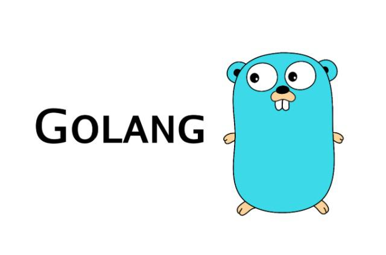

# 00|故事的开始: Hello World



## Go语言简介

Go 即Golang，是Google公司2009年11月正式对外公开的一门编程语言。

Go是静态强类型语言，是区别于解析型语言的编译型语言。

​	解析型语言——源代码是先翻译为中间代码，然后由解析器对代码进行解释执行。

​	编译型语言——源代码编译生成机器语言，然后由机器直接执行机器码即可执行。

### 1.语言特性

跨平台的编译型语言

语法接近C语言

管道（channel），切片（slice），并发（routine）

有垃圾回收的机制

支持面向对象和面向过程的编程模式

### 2.特色与擅长领域

编程模式比较简单，没有复杂的设计模式

最新版本也有动态库形式，对跨语言调用的支撑更到位

开源框架比较成熟，新崛起的互联网公司都在用——如滴滴，uber，百度，阿里巴巴，oppo，vivo等

微服务的开发模式下Go语言是新宠

服务开发，web的api开发，分布式服务集群的开发

容器docker是go开源的产品，k8s等这些都是基于go语言的

对高并发、高性能的系统和服务支撑，Go语言对比其他语言有更快的开发速度，更高的开发效率

独有的语言特性和设计模式routine，channel，sync包支撑了海量并行的支持。

所以能看到这些领域都在使用Go语言：微服务开发模式，api开发，rpc服务开发，游戏服务开发等等


## Hello World

老规矩，首先从一个Hello World程序开始编写第一段代码

每一个Go代码的项目，都会有一个main包与main函数

需要注意的是，Go语言的manin函数并不接受任何参数以及无任何返回值

```GO
//main包中的main函数是程序的入口
package main  //包声明，表明代码所属模块

import "fmt"
import "os"

//函数实现,main函数不接受任何参数,通过os.Args获取参数
func main(){
	if len(os.Args) > 1{
		fmt.Println("Hello World! This is " + os.Args[1])
		os.Exit(0)	//main函数无任何返回值，通过exit来返回状态
	}
	os.Exit(-1)
}


```

Go代码怎么运行呢？这里提供两种方式

```go
代码运行方式:
1.直接运行: go run 1_hello.go
2.编译运行: go build 1_hello.go; ./hello
```

