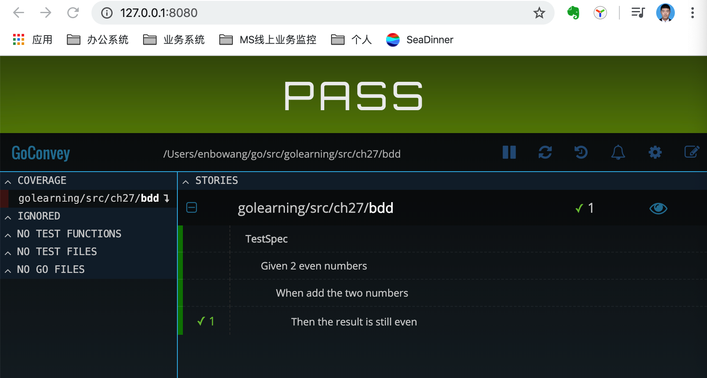

# 27| BDD

> BDD，即Behavior Driven Development。行为驱动开发

使用Story Card藐视一种用户场景，针对这种场景进行测试。'正面'是这个场景的描述，背面是这个场景的具体参数化数据(Given、When、Then)

## Go语言中的BDD框架

安装

> go get -u github.com/smartystreets/goconvey

代码示例如下

```go
package bdd

import (
	. "github.com/smartystreets/goconvey/convey"
	"testing"
)

func TestSpec(t *testing.T){
	Convey("Given 2 even numbers",t,func(){
		a := 2
		b := 4
		Convey("When add the two numbers",func(){
			c := a + b
			Convey("Then the result is still even",func(){
				So(c%2,ShouldEqual,0)
			})
		})
	})
}
```

运行结果

```
➜  bdd go test -v
=== RUN   TestSpec

  Given 2 even numbers 
    When add the two numbers 
      Then the result is still even ✔


1 total assertion

--- PASS: TestSpec (0.00s)
PASS
ok      golearning/src/ch27/bdd 1.750s

```

使用Web UI模式

> $ GOPATH/bin/goconvey 并浏览器打开http://127.0.0.1:8080/



