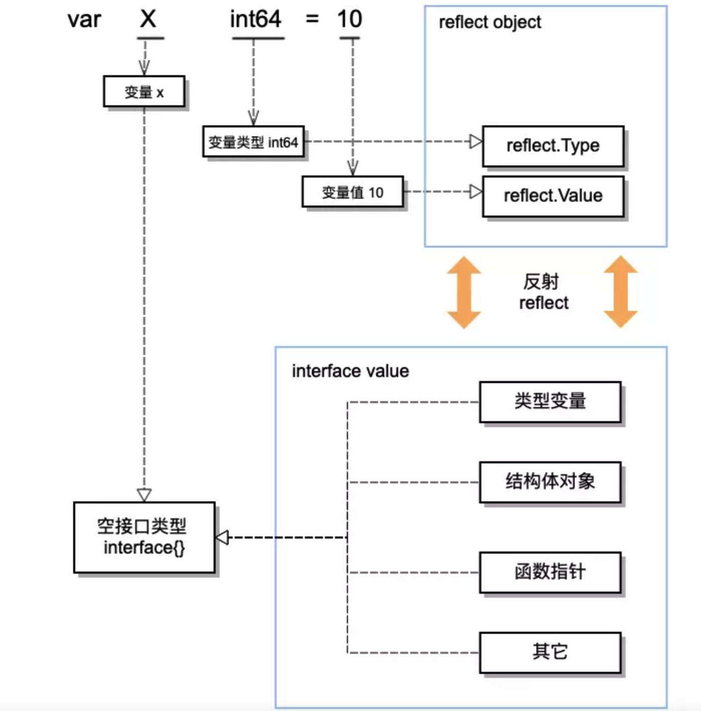

# 28|反射编程

## 基本概念

开始具体篇幅之前，先看一下反射三原则：

- Reflection goes from interface value to reflection object.
- Reflection goes from reflection object to interface value.
- To modify a reflection object, the value must be settable.

在三原则中，有两个关键词 `interface value` 与 `reflection object`。有点难理解，画张图可能你就懂了。



先看一下什么是**反射对象** `reflection object`？ 反射对象有很多，但是其中最关键的两个反射对象`reflection object`是：`reflect.Type`与`reflect.Value`.直白一点，就是对变量`类型`与`值`的抽象定义类，也可以说是变量的元信息的类定义.

再来，为什么是**接口变量值** `interface value`, 不是变量值 `variable value` 或是对象值 `object value` 呢？因为后两者均不具备广泛性。在 Go 语言中，空接口 `interface{}`是可以作为一切类型值的通用类型使用。所以这里的接口值 `interface value` 可以理解为**空接口变量值** `interface{} value`。

结合图示，将反射三原则归纳成一句话：

> 通过反射可以实现**反射对象** `reflection object`与**接口变量值** `interface value`之间的相互推导与转化, 如果通过反射修改对象变量的值，前提是对象变量本身是`可修改`的。

## 代码示例

```go
package reflect

import (
	"fmt"
	"reflect"
	"testing"
)

//反射传入值的类型
func CheckType(v interface{}) {
	t := reflect.TypeOf(v)
	switch t.Kind() {
	case reflect.Float32,reflect.Float64:
		fmt.Println("Float")
	case reflect.Int,reflect.Int32,reflect.Int64:
		fmt.Println("Integer")
	default:
		fmt.Println("Unknown",t)
	}
}

//测试程序
func TestBasicType(t *testing.T){
	var f float64 = 12
	CheckType(f)
	fmt.Printf("%v\n","Hello")
}

//得到传入值的类型和值
func TestTypeAndValue(t *testing.T) {
	var f float64 = 10
	t.Log(reflect.TypeOf(f),reflect.ValueOf(f))
	t.Log(reflect.ValueOf(f).Type())
}

//获取结构体中的值和方法调用
type Employee struct {
	EmployeeID string
	Name string `format:"normal"`	//struct tag
	Age int
}

func (e *Employee)UpdateAge(newVal int){
	e.Age = newVal
}

func TestInvokeByName(t *testing.T){
	e := &Employee{"1","Mike",10}
	//方式一 使用reflect.value.FieldByName 直接获得值
	t.Logf("Name: value(%[1]v), Type(%[1]T) ", reflect.ValueOf(*e).FieldByName("Name"))
	//方式二 使用reflect.type.FieldByName 会获得两个值
	if nameField,ok := reflect.TypeOf(*e).FieldByName("Name");!ok {
		t.Error("Failed to get 'Name'")
	}else{
		//访问Struct Tag，如json解析框架就是用了这种方式
		t.Log("Tag:format",nameField.Tag.Get("format"))
	}
	//函数使用
	reflect.ValueOf(e).MethodByName("UpdateAge").Call([]reflect.Value{reflect.ValueOf(1)})
	t.Log("Updated Age:",e)
}
```

## 切片与map的比较

我们知道，go语言中map和切片是没有办法直接进行比较的(只能同nil进行比较)；可以使用reflect中的DeepEqual进行比较

```go
Learn more or give us feedback
package flexible_reflect

import (
	"errors"
	"reflect"
	"testing"
)

func TestDeepEqual(t *testing.T) {
	a := map[int]string{1: "one", 2: "two", 3: "three"}
	b := map[int]string{1: "one", 2: "two", 3: "three"}
	//t.Log(a == b)
	t.Log(reflect.DeepEqual(a, b))

	s1 := []int{1, 2, 3}
	s2 := []int{1, 2, 3}
	s3 := []int{2, 3, 1}
	t.Log("s1 == s2?", reflect.DeepEqual(s1, s2))
	t.Log("s1 == s3?", reflect.DeepEqual(s1, s3))

}
```

## 万能程序

通过反射实现一个万能程序，给不同的结构体中某些共同的字段赋值

```go
package flexible

import (
	"github.com/pkg/errors"
	"reflect"
	"testing"
)

type Employee struct {
	EmployeeID	string
	Name		string `format:"normal"`
	Age 		int
}

func (e *Employee) UpdateAge(newVal int) {
	e.Age = newVal
}

type Customer struct {
	CookieID string
	Name     string
	Age      int
}

func fillBySettings(st interface{},settings map[string]interface{}) error {
	if reflect.TypeOf(st).Kind() != reflect.Ptr {
		return errors.New("the first param should be a pointer to the struct type.")
	}
	// Elem() 获取指针指向的值
	if reflect.TypeOf(st).Elem().Kind() != reflect.Struct {
		return errors.New("the first param should be a pointer to the struct type.")
	}

	if settings == nil {
		return errors.New("settings is nil.")
	}
	var field reflect.StructField
	var ok bool
	for k,v := range settings{
		if field,ok = (reflect.ValueOf(st)).Elem().Type().FieldByName(k);!ok{
			continue
		}
		if field.Type == reflect.TypeOf(v) {
			vstr := reflect.ValueOf(st).Elem()
			vstr.FieldByName(k).Set(reflect.ValueOf(v))
		}
	}
	return nil

}

func TestFillNameAndAge(t *testing.T) {
	settings := map[string]interface{}{"Name": "Mike", "Age": 30}
	e := Employee{}
	if err := fillBySettings(&e, settings); err != nil {
		t.Fatal(err)
	}
	t.Log(e)
	c := new(Customer)
	if err := fillBySettings(c, settings); err != nil {
		t.Fatal(err)
	}
	t.Log(*c)
}
```


