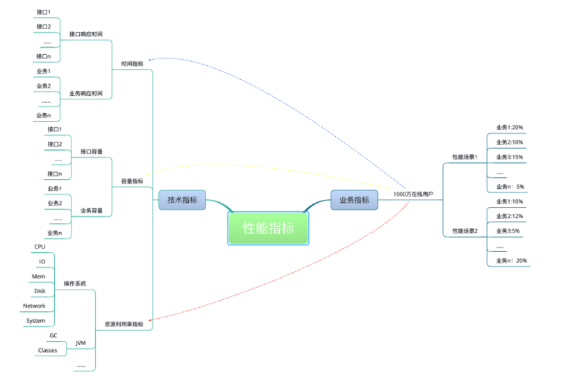
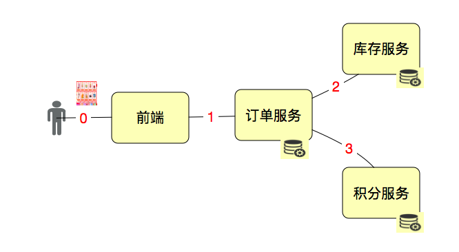

# 02|性能指标理解

​	通常我们都从两个层面定义性能场景的需求指标：业务指标和技术指标。这两个层面需要有映射关系，技术指标不能脱离业务指标。

​	一旦脱离，你会发现你能回答“一个系统在多少响应时间之下能支持多少 TPS”这样的问题，但是回答不了“业务状态是什么”的问题。

​	举例来说，如果一个系统要支持 1000 万人在线，可能你能测试出来的结果是系统能支持 1 万 TPS，可是如果问你，1000 万人在线会不会有问题？这估计就很难回答了。

我在这里画一张示意图以便你理解业务指标和性能指标之间的关系。

​	所有的技术指标都是在有业务场景的前提下制定的，而技术指标和业务指标之间也要有详细的换算过程。这样一来，在回答了技术指标是否满足的同时，也能回答是否可以满足业务指标。

​	为了区分这些概念，我们先说一下 TPS（Transactions Per Second）。我们都知道 TPS 是性能领域中一个关键的性能指标概念，它用来描述每秒事务数。我们也知道 TPS 在不同的行业、不同的业务中定义的粒度都是不同的。

​	所以不管你在哪里用 TPS，一定要有一个前提，就是所有相关的人都要知道你的 T 是如何定义的。经常有人问，TPS 应该如何定义？这个实在是没有具体的“法律规定”，那就意味着，你想怎么定就怎么定。

​	通常情况下，我们会根据场景的目的来定义 TPS 的粒度。如果是接口层性能测试，T 可以直接定义为接口级；如果业务级性能测试，T 可以直接定义为每个业务步骤和完整的业务流。如下图

​	如果我们要单独测试接口 1、2、3，那 T 就是接口级的；如果我们要从用户的角度来下一个订单，那 1、2、3 应该在一个 T 中，这就是业务级的了。